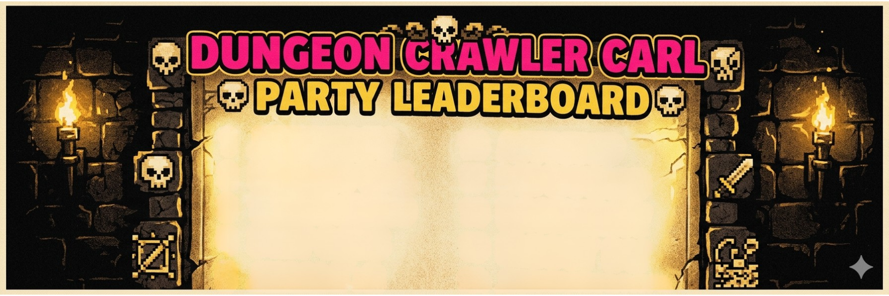

<p align="center">
  
</p>

# Dungeon Crawler Carl themed party-in-a-box

Everything you need to host your own **Dungeon Crawler Carl themed party**. This repo is a party-in-a-box: a collection of resources, ideas, and tools purpose-built for an immersive DCC party experience.

The centerpiece is a **real-time party leaderboard app** — a two-screen browser app with a TV display screen for the room and a mobile admin panel so the host can award points on the fly all night long.

## Features

- **Live leaderboard** — TV display auto-refreshes every 3 seconds
- **Mobile admin panel** — add crawlers, award points, undo mistakes
- **Celebration overlay** — a full-screen image + audio clip fires on the TV whenever points are awarded
- **Banner image** — a persistent header image on the display screen
- **Persistent state** — all data survives server restarts via a local JSON file
- **Local network sync** — admin panel on your phone, display on your laptop connected to a TV

## Stack

- **Backend:** Python / FastAPI / Uvicorn
- **Frontend:** Vanilla HTML + CSS + JavaScript (single file, no build step)
- **Storage:** Local `state.json` file

## Setup

### 1. Create and activate a virtual environment

```bash
python3 -m venv .venv
source .venv/bin/activate  # macOS / Linux
# or on Windows:
.venv\Scripts\activate
```

Your prompt will change to show `(.venv)` when the environment is active. Run all subsequent commands inside it.

### 2. Install dependencies

```bash
pip install fastapi uvicorn python-multipart
```

To deactivate the virtual environment when you're done:

```bash
deactivate
```

### 3. Add your media (optional)

- Drop image files (`.jpg`, `.png`, `.gif`, `.webp`) into `images/`
- Drop audio files (`.mp3`, `.wav`, `.m4a`, `.ogg`) into `audio/`
- Drop rotating trivia images into `assets/images/rotating_trivia_images/`

#### Suggested image aspect ratios

| Image type | Where it appears | Suggested ratio | Notes |
|---|---|---|---|
| **Banner image** | Top of the TV display screen | **6:1 to 8:1** (wide landscape) | e.g. 1920×280 px. Taller images will be cropped. |
| **Celebration image** | Fullscreen overlay on point award | **1:1** (square) | Displayed centered with letterboxing; square fills the most screen space. |
| **Rotating trivia images** | Left half of screen during trivia | **9:16** (portrait) | The trivia panel is a tall, narrow column. Portrait images fill it best; landscape images will be cropped on the sides. |

### 3. Run the server

```bash
python3 server.py
```

The terminal will print your local network IP:

```
==================================================
  DCC LEADERBOARD — Jeff's 47th
==================================================
  Local:   http://localhost:5500
  Network: http://192.168.x.x:5500

  TV Display:   http://192.168.x.x:5500?screen=display
  iPhone Admin: http://192.168.x.x:5500?screen=admin
==================================================
```

## Usage

| URL | Purpose |
|-----|---------|
| `http://<ip>:5500` | Landing page |
| `http://<ip>:5500?screen=display` | TV leaderboard (open on the machine connected to the TV) |
| `http://<ip>:5500?screen=admin` | Admin panel (open on your phone via WiFi) |

### Admin panel

- **Add Crawler tab** — add and remove party guests by character name
- **Award Points tab** — tap a name to select, then tap a point value (+1 / +3 / +5 / +10 / +25 / +50). Undo button reverses the last award.
- **Settings** — edit the leaderboard title and subtitle, set a banner image, and assign a celebration image + audio track. Hit **Save Settings** to apply.

### Display screen

- Top 10 ranked by points, auto-updating
- Rank #1 gets gold treatment
- Rows pulse when a rank changes
- Celebration overlay fires fullscreen (with audio) whenever points are awarded
- Optional banner image at the top

## Project structure

```
birthday_leaderboard/
├── server.py       # FastAPI backend
├── index.html      # Full frontend (landing + display + admin)
├── state.json      # Auto-generated at runtime, gitignored
├── images/         # Drop your image files here
└── audio/          # Drop your audio files here
```

## License

MIT
